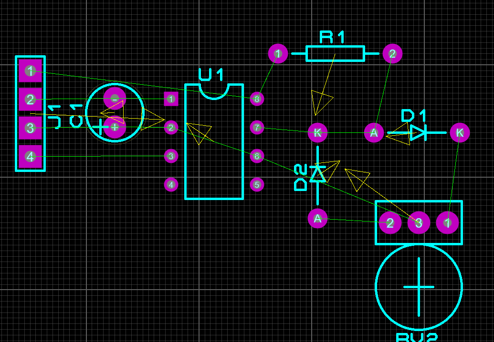
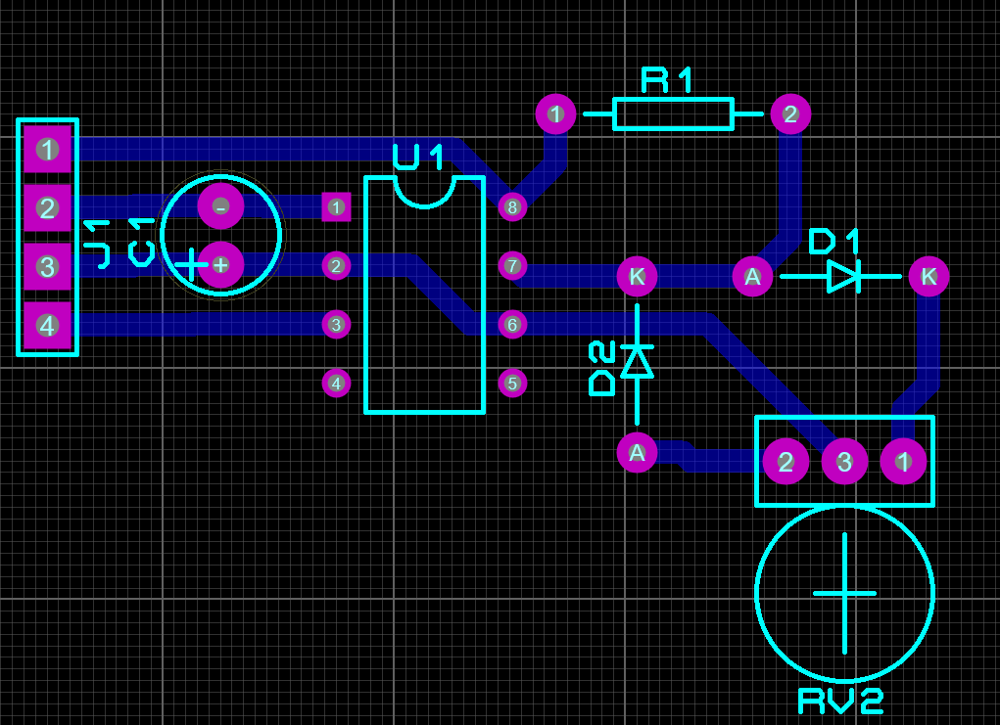
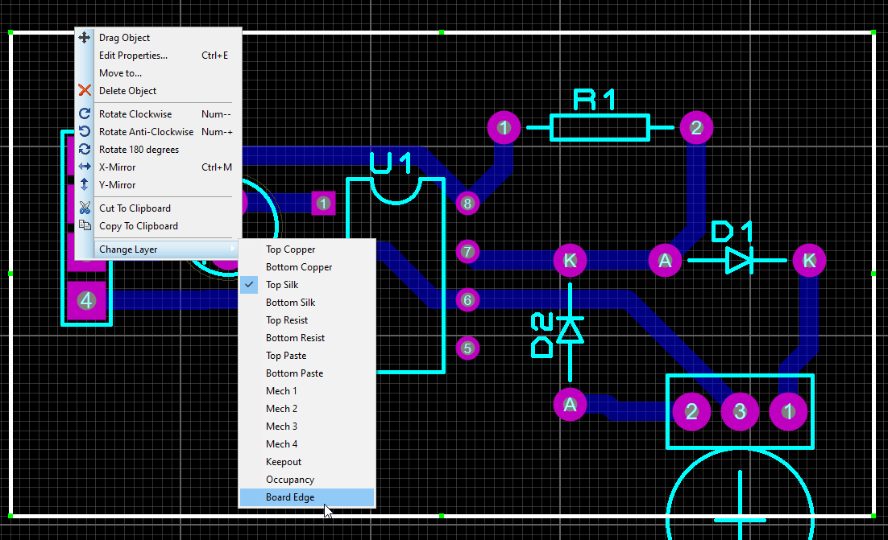
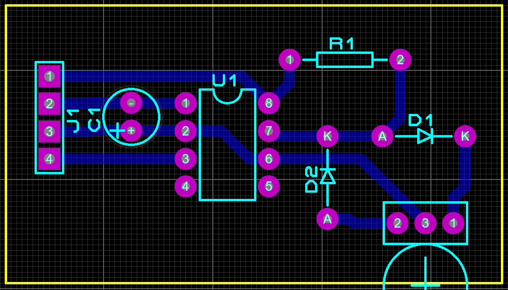
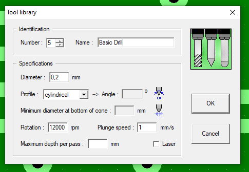
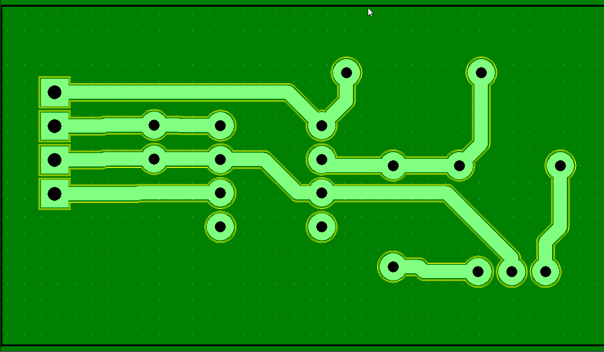
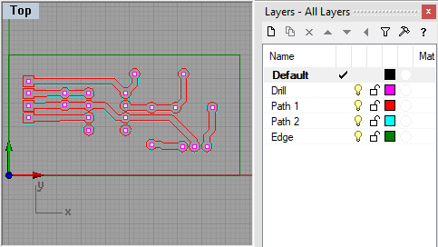
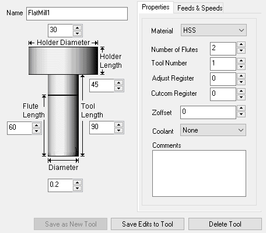

# Инструкция по работе с цепочкой протеус-куппер-рино

> Автор - Трофимов М. [@Matroftt](https://github.com/Matroftt)

## PROTEUS

1\. Создаем схему на протоусе. Используйте только коннекторы.

1.1\. Переименовываем все свои компоненты, чтобы их можно было отличить. Одинаковых имен быть не должно.

## PROTEUS PCB

2\. Выбираем в тулбаре PCB layout, и переходим в него

2.1\. Ставим все коннекторы на эту схему

2.2\. С помощью Track Mode подключаете коннекторы к ардуинке (GND к GND, 5V к 5V, и т.д.)
     Дорожки НЕ ДОЛЖНЫ пересекаться друг с другом, иначе будет короткое замыкание. 
	Исключение для одинаковых дорожек (Т.е. GND можно подвести к другому GND)
 

2.3\. Ставим границы платы: Ставим прямоугольник > ПКМ по нему > Change Layer > Board edge

2.4\. Выбираем Output - Generate Gerber/Exclession file
     В экспорте отмечаем только Bottom Copper и Drill, ставим папку в который экспортируется файл

Так выглядит готовая схема в протеусе.
 

## COPPERCAM
  
3\.  Открываем CopperCam, Выбираем Parameters - Tool library, ищем слот для еще не созданного инструмента
    Вводим следующие значения - Diameter - 0.2 mm, Profile: Cylindrical, Rotation: 12000 rpm, Plunge speed - 1 mm/s
    Имя можно поставить любое
    
 

3.1\. Нажимаем File - Open - New circuit
     В Solder Side импортируем GBR файл с Bottom Copper в названии, а в Drills - с Drill
     Убираем галочку у Call Milling Process immediately

 
     
3.2\. В окне "Is this file import valid?" и следующем нажимаем Да,
     в окне "Set countours" Number of successive countours - число 2, В Tool выбираем наш ранее созданный инструмент и OK.
     
3.3\.  Сохраняем файл в формате DXF (File - Save), в export ничего не изменяем, в следующей вкладке в Sequence выбираем Drill then Mill

Так выглядит готовая плата в CopperCam.

 

## RHINO

4\. Открываем полученный файл в рино. Выравниваем дриллы и плату на уровне путей.

 

4.1\. Создаем спираль (Curve -> Spiral -> Flat), в значении Turns должно стоять число 3;
	 Выставляем любой дрилл как центр, и создаем спираль вокруг него размером в 1 кв. миллиметр
  
4.2\. Вокруг схемки рисуем границы платы, после чего создаем такую же границу, но удаленную каждой стороной от уже существующей на 5 мм

4.3\. Выделяем пути, обе границы схем, дриллы со спиралями как слои, выбираем цвет. 

 

4.4\. В RhinoCAM создаем Engraving, в нем выбираем все дорожки;
     Создаем тул на плоское жало 0.2 мм;
     Во вкладке "Feeds & Speeds" в каждом параметре должно быть введено значение 500 кроме рпм, которая стоит на 8000 RPM;
     Во вкладке "Sorting" ставим Minimum Distance Sort и Lower Left;
     В "Cut Parameters" должно стоять значение 0.03, все остальные - 0;
     В "Clearance" - Absolute Z Value на 6, и выбираем Clearance Plane
     Нажимаем Generate

Тул, который нужно создать

 

4.5\. Тоже самое повторяем для Drill

4.6\. Создаем Pocketing, в нем также выбираем все дорожки с меньшей стороной платы, ставим все прошлые параметры кроме Minimum Distance Sort.
      В Entry/Exit все значения должны быть по нулям;
      В Cut Parameters выставляем Tolerance - 0.03, Stock - 0, Linear Cuts, Mixed, Start at bottom, Tool Dia. - 50%,  Cut Direction - Mixed, Cut Start Side - Right, Включаем Cleanup Pass;
      нажимаем Generate.

4.7\. Нажимаем ПКМ по MOp set, нажимаем Post, именуем файл и сохраняем.

## CANDLE

5\.   Открываем Candle 1.1.7

5.1\. Открываем файл в формате .nc, полученный из рино; Тестируем плату, вводя значения ее длины и ширины.

5.2\. Перемещаем жало станка в нижний левый угол платы, устанавливаем нулевые координаты по всем осям.

5.3\. Медленно опускаем жало до тех пор, пока его коническая часть не уйдет внутрь текстолита.

5.4\. Нажимаем кнопку Send, ошибки игнорируем.

Ждем некоторое время, и плата готова!
